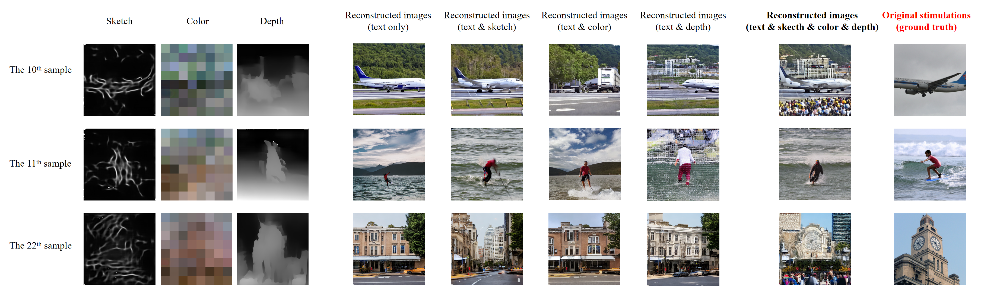
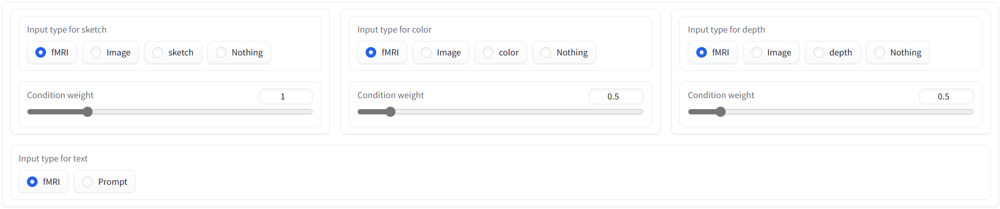
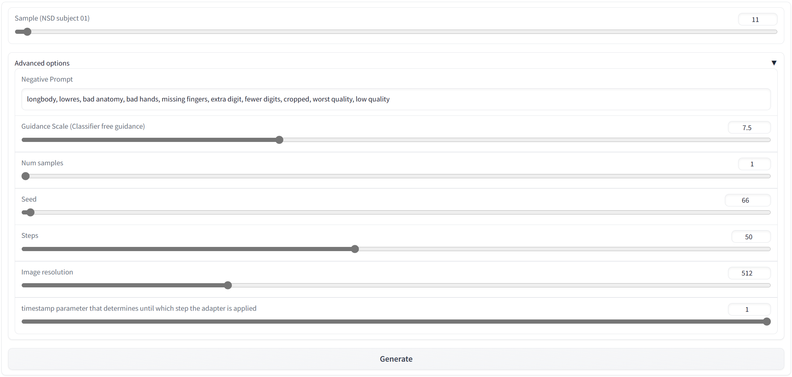
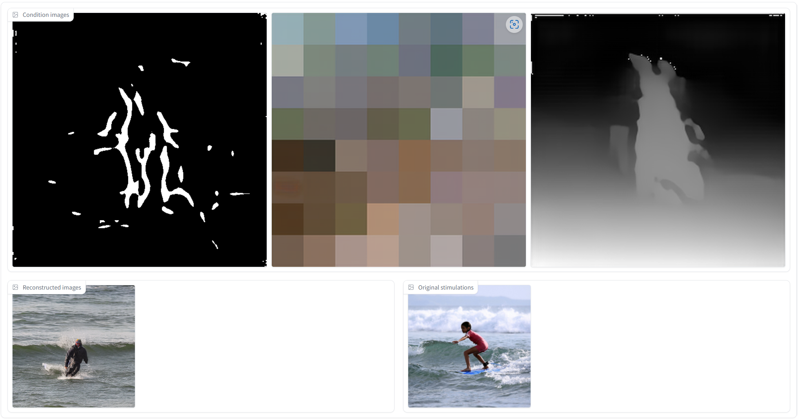

  # VisualDiffuser
  

  
  ### Official implementation of **"VisualDiffuser: A Human Visual System-Inspired Visual Decoding Network" (tentative)**.
  
  The code is coming soon!
  

## Demo 
I have implemented a user-friendly WebUI for VisualDiffuser with the help of `Gradio`, you can access it via the link: https://80585e71063c634c17.gradio.live
- The default username is `demo`, and the corresponding default password is `iacas-bjut`. If you find it doesn't work or any other issues, please contact me at gengcheng.li@ucdconnect.ie. I'll be happy to help you in any way I can. :-D
- Take the 11th sample of subject 01 in the NSD valuation dataset as an example:

  
  
  
  

